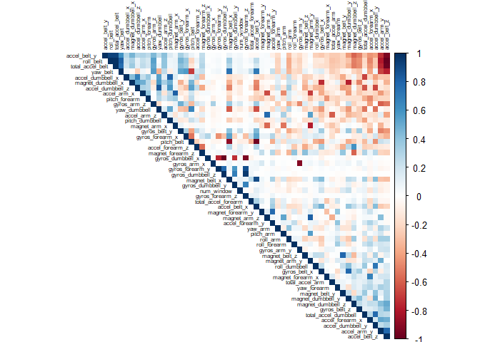

Background
----------

Using devices such as Jawbone Up, Nike FuelBand, and Fitbit it is now
possible to collect a large amount of data about personal activity
relatively inexpensively. These type of devices are part of the
quantified self movement - a group of enthusiasts who take measurements
about themselves regularly to improve their health, to find patterns in
their behavior, or because they are tech geeks. One thing that people
regularly do is quantify how much of a particular activity they do, but
they rarely quantify how well they do it.

This project focuses on using data from accelerometers on the belt,
forearm, arm, and dumbell of 6 participants. They were asked to perform
barbell lifts correctly and incorrectly in 5 different ways. The goal of
your project is to predict the manner in which they did the exercise.
The datasets are privided below.

-   [Training](https://d396qusza40orc.cloudfront.net/predmachlearn/pml-training.csv)
-   [Testing](https://d396qusza40orc.cloudfront.net/predmachlearn/pml-testing.csv)

In the dataset, `classe` is the variable we will try to predict
according to the following guidelines:

-   A: exactly according to the specification
-   B: throwing the elbows to the front
-   C: lifting the dumbbell only halfway
-   D: lowering the dumbbell only halfway
-   E: throwing the hips to the front

<!-- -->

    # Load libraries
    library(ggplot2)
    library(caret)
    library(corrplot)

    # Load datasets
    training <- read.csv("pml-training.csv", na.strings = "")
    validating <- read.csv("pml-testing.csv", na.strings = "")

Cleaning data
-------------

Before any fancy algorithm implementation we need to clean the data and
remove all the non-significant variables from both training and testing
data sets. For removing the non-significant variables we can use
`nonZeroVar` function, which diagnoses predictors that have one unique
value (i.e. are zero variance predictors). Then we could use an `apply`
family function in order to identify those variables that are mostly NA
values. On the oder hand, the fisrt 5 columns are descriptive
information for each observation, we will need to remove them as well.

    # Removing non-significant variables from the datasets
    non_var <- nearZeroVar(training)
    training <- training[,-non_var]; validating <- validating[,-non_var]

    # Removing those variables that are mostly NA values
    NA_var <- sapply(training, FUN = function(x) {mean(is.na(x))}) < 0.6
    training <- training[,NA_var]
    validating <- validating[,NA_var]

    # Removing variables regarding label or identification
    training <- training[, -(1:5)]
    validating <- validating[, -(1:5)]

    # Create a factor 
    training$classe <- as.factor(training$classe)

    # Create the testing set
    inTrain  <- createDataPartition(training$classe, p=0.7, list=FALSE)
    training <- training[inTrain, ]
    testing  <- training[-inTrain, ]

Exploratory Data Analysis
-------------------------

Since we have numeric variables, we can perform a correlation matrix and
then use `corrplot` function in order to graphically display of a
correlation matrix. The most highly correlated variables are shown as
intense tones; while the colors are in function of direction; blue for
directly proportional and red for inversely proportional.

    # Create correlation matrix
    correlogram <- cor(training[,-which(names(training) == 'classe')])

    # Create correlogram
    corrplot(correlogram, order = "FPC", method = "color", type = "upper", 
             tl.cex = 0.5, tl.col = rgb(0, 0, 0))

Processing Data
---------------

    set.seed(164)
    # Create a function to calculate the range and take a sample of 15 observations
    ranges <- sample(sapply(training[,-54], FUN = function(x) {max(x) - min(x)} ), size=15, replace = FALSE)

    # Create a dataframe with the results
    data.frame(Range=ranges, row.names = names(ranges))

    ##                     Range
    ## total_accel_arm     65.00
    ## magnet_dumbbell_x 1231.00
    ## pitch_forearm      162.30
    ## gyros_forearm_x     25.52
    ## gyros_dumbbell_x   206.22
    ## roll_arm           360.00
    ## roll_forearm       360.00
    ## gyros_belt_x         3.20
    ## yaw_arm            360.00
    ## accel_dumbbell_z   652.00
    ## gyros_arm_z          5.32
    ## accel_belt_y       229.00
    ## accel_forearm_z    697.00
    ## magnet_arm_z      1290.00
    ## magnet_belt_y      319.00

The code above help us to see the range of some of the variables (n=15)
in the training dataset. Since the variables perform on different
scales, it is necessary to standardize them to have a more homogeneous
dataset, otherwise some variables may get more weight over others.

    # Sacale the training/testing dataset
    training[,-54] <- scale(training[,-54])
    testing[,-54] <- scale(testing[,-54])
    validating <- scale(validating[,-54])

Training: Random Forest
-----------------------

Since our prediction variable is not numeric, we will need to perform a
classification method. `Random forest` is a methods for classification
that operate by constructing a multitude of decision trees at training
time and outputting the class that is the mode of the classes
(classification) of the individual trees.

    # Crete a control parameters
    controlRF <- trainControl(method="cv", number=3, verboseIter=FALSE)

    # Fit the model
    modFitRandForest <- train(classe ~ ., data=training, method="rf", trControl=controlRF)
    modFitRandForest$finalModel

    ## 
    ## Call:
    ##  randomForest(x = x, y = y, mtry = param$mtry) 
    ##                Type of random forest: classification
    ##                      Number of trees: 500
    ## No. of variables tried at each split: 27
    ## 
    ##         OOB estimate of  error rate: 0.17%
    ## Confusion matrix:
    ##      A    B    C    D    E  class.error
    ## A 3905    0    0    0    1 0.0002560164
    ## B    6 2650    2    0    0 0.0030097818
    ## C    0    4 2392    0    0 0.0016694491
    ## D    0    0    6 2246    0 0.0026642984
    ## E    0    0    0    4 2521 0.0015841584

With the model we will use `confusionMatrix` function in order to
calculates a cross-tabulation of observed and predicted classes with
associated statistics. From the results we can see that the Accuracy of
the model is 0.9561 and the Cohen Kappa Coeficient 0.9445.

    # Evaluating testing dataset with ConfusionMatrix
    RF_prediction <- predict(modFitRandForest, newdata=testing)
    confMatRandForest <- confusionMatrix(RF_prediction, testing$classe)
    confMatRandForest

    ## Confusion Matrix and Statistics
    ## 
    ##           Reference
    ## Prediction    A    B    C    D    E
    ##          A 1167    1    0    0    0
    ##          B   29  736    7    0    0
    ##          C    0   13  704    8    0
    ##          D    0    4   16  696    1
    ##          E    0    0    2    0  743
    ## 
    ## Overall Statistics
    ##                                           
    ##                Accuracy : 0.9804          
    ##                  95% CI : (0.9757, 0.9844)
    ##     No Information Rate : 0.2898          
    ##     P-Value [Acc > NIR] : < 2.2e-16       
    ##                                           
    ##                   Kappa : 0.9752          
    ##                                           
    ##  Mcnemar's Test P-Value : NA              
    ## 
    ## Statistics by Class:
    ## 
    ##                      Class: A Class: B Class: C Class: D Class: E
    ## Sensitivity            0.9758   0.9761   0.9657   0.9886   0.9987
    ## Specificity            0.9997   0.9893   0.9938   0.9939   0.9994
    ## Pos Pred Value         0.9991   0.9534   0.9710   0.9707   0.9973
    ## Neg Pred Value         0.9902   0.9946   0.9927   0.9977   0.9997
    ## Prevalence             0.2898   0.1827   0.1766   0.1706   0.1803
    ## Detection Rate         0.2828   0.1783   0.1706   0.1686   0.1800
    ## Detection Prevalence   0.2830   0.1871   0.1757   0.1737   0.1805
    ## Balanced Accuracy      0.9877   0.9827   0.9798   0.9913   0.9990

The prediction for the validating dataset is show below.

    # Predicting the values
    predictValidating <- predict(modFitRandForest, newdata=validating)
    predictValidating

    ##  [1] E A A E C E D D A E B E D A E D E B E B
    ## Levels: A B C D E
